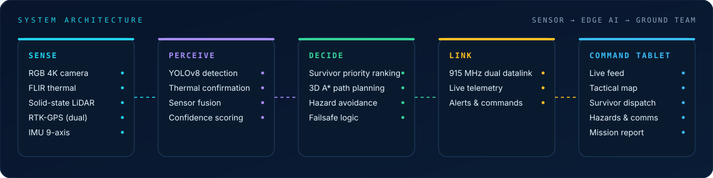
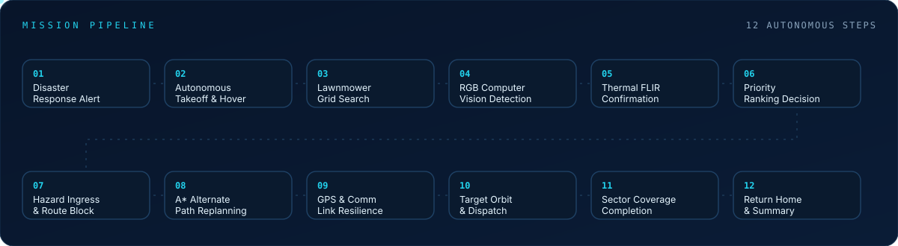
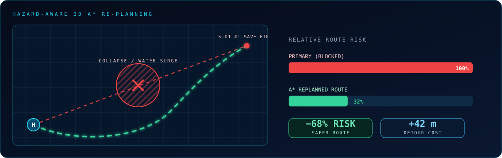
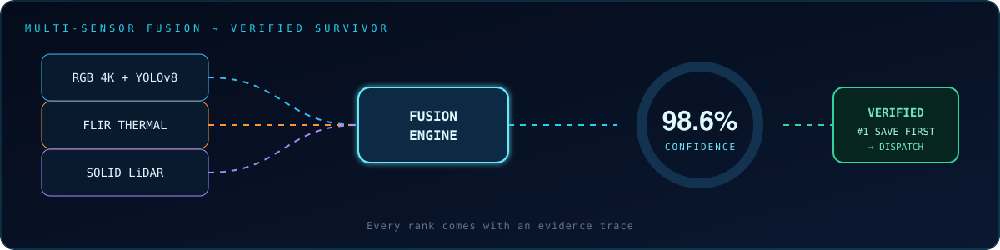
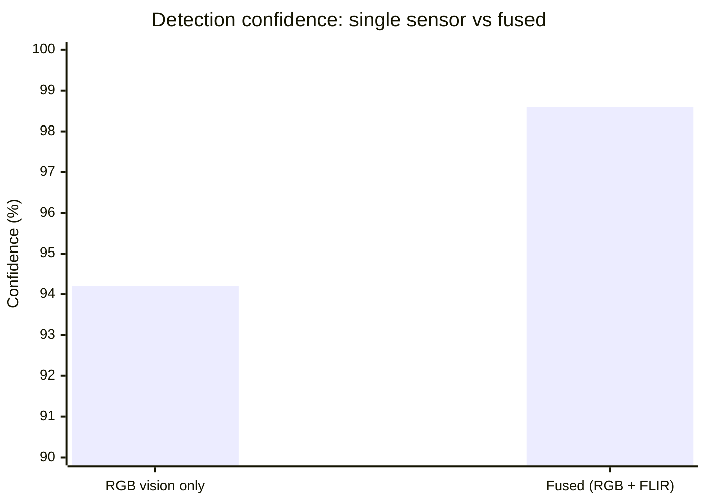
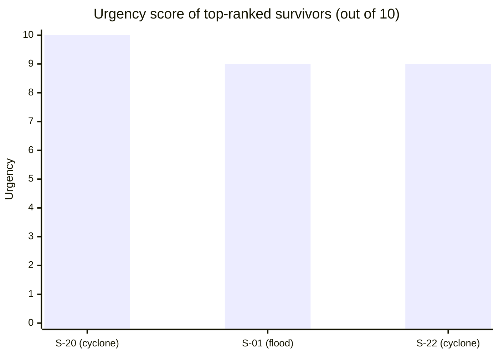
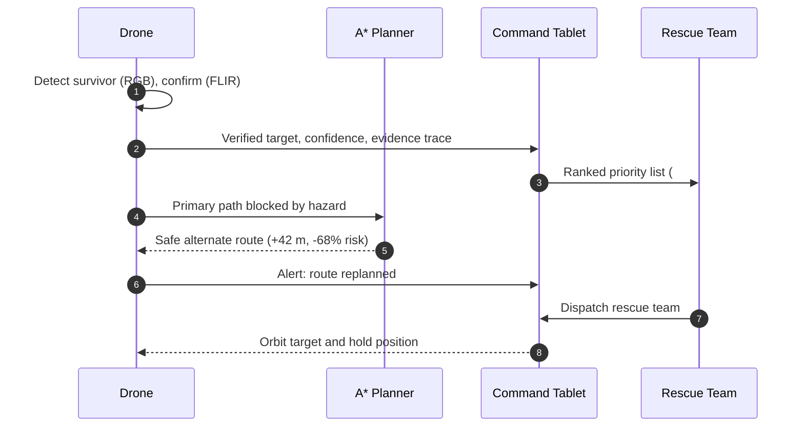

<div align="center">



<br/>



<br/>


**[Overview](#overview) · [Architecture](#system-architecture) · [Mission](#the-12-step-autonomous-mission) · [Scenarios](#three-disaster-scenarios) · [Fusion](#multi-sensor-fusion) · [Priority](#survivor-priority-queue) · [Command Tablet](#command-tablet) · [Stress Test](#autonomy-stress-test) · [Run](#run-locally)**

</div>

---

## Overview

**RAKSHAAN** (*"protector"*) is an autonomous rescue-drone simulator. It demonstrates how an AI-driven drone can take over the most dangerous part of a disaster response: **searching for people in places rescuers cannot safely reach**.

When an alert arrives, RAKSHAAN takes off on its own and sweeps the affected sector. It detects humans with computer vision, confirms them with thermal imaging, ranks every survivor by urgency, and re-plans its route the moment a hazard blocks the way. Results are handed to the ground team through a **Command Tablet**, with a clear explanation behind every decision.

<div align="center">


<sub>Flood-zone mission in the 4D engine: live telemetry, hazard alerts, survivor detection and the step-by-step mission player.</sub>

</div>

### Key capabilities

| Capability | What it does |
|---|---|
| **Sensor fusion** | RGB 4K vision and FLIR thermal must agree before a survivor is marked *verified*. |
| **Explainable ranking** | Every survivor rank has a *Why this rank?* evidence trace. |
| **Hazard-aware re-planning** | 3D A\* re-routes around blocked paths: **+42 m detour, −68 % risk** in the demo. |
| **Failsafe testing** | Inject GPS loss, comm loss, hazards and low battery to watch the drone cope. |
| **Cinematic 4D playback** | Eight camera modes, an auto-director, 0.25×–4× speed and step-by-step control. |
| **Command Tablet** | Live feed, tactical map, survivors, hazards, drone health, comms and reports. |

---

## System Architecture

<div align="center">

</div>

---

## The 12-Step Autonomous Mission

```mermaid
flowchart LR
    A([Alert]) --> B[Takeoff & Hover]
    B --> C[Lawnmower Grid Search]
    C --> D[RGB Vision Detection]
    D --> E[Thermal FLIR Confirmation]
    E --> F[Priority Ranking]
    F --> G{Route blocked?}
    G -- yes --> H[A* Re-planning]
    G -- no --> I
    H --> I[GPS & Comm Resilience]
    I --> J[Target Orbit & Dispatch]
    J --> K[Sector Coverage Complete]
    K --> L([Return Home & Summary])

    style A fill:#3b1219,stroke:#f87171,color:#fff
    style G fill:#3b2a0a,stroke:#fbbf24,color:#fff
    style H fill:#053b2e,stroke:#34d399,color:#fff
    style L fill:#0c3a5c,stroke:#22d3ee,color:#fff
```

<div align="center">

</div>

<br/>



### Re-planning when the path is blocked

<div align="center">

</div>

<details>
<summary><b>Step-by-step breakdown</b></summary>

| # | Step | What happens |
|---|------|--------------|
| 01 | Disaster Response Alert | Mission is triggered for the selected disaster sector. |
| 02 | Autonomous Takeoff & Hover | Drone lifts off and stabilises; storm mode compensates for wind gusts. |
| 03 | Lawnmower Grid Search | Systematic back-and-forth coverage; LiDAR builds a 3D terrain map. |
| 04 | RGB Computer Vision Detection | YOLOv8-based detection flags possible humans. |
| 05 | Thermal FLIR Confirmation | Body-heat signature verifies the detection; fusion score climbs to ~98 %. |
| 06 | Priority Ranking Decision | Survivors are scored on urgency and ranked (*#1 Save First*). |
| 07 | Hazard Ingress & Route Block | A collapse, water surge or landslide blocks the planned path. |
| 08 | A\* Alternate Path Replanning | Safe alternate route generated (**+42 m, −68 % risk**). |
| 09 | GPS & Comm Link Resilience | Drone keeps operating through GPS or link degradation. |
| 10 | Autonomous Target Orbit & Dispatch | Drone orbits the target and alerts the rescue team. |
| 11 | Sector Coverage Completion | Remaining grid is finished and coverage confirmed. |
| 12 | Return To Home & Mission Summary | Automatic return with a full mission report. |

</details>

---

## Three Disaster Scenarios

One engine, three different emergencies. Scenarios switch live from the top bar.

<table>
<tr>
<td width="50%" align="center">

<br/><b>Flood zone</b><br/>
<sub>Rising water at 0.5 m/hr and an unstable tower-crane base (LiDAR detected a 4.2° tilt). A survivor on a high platform is verified at 37.2 °C.</sub>
</td>
<td width="50%" align="center">

<br/><b>Landslide</b><br/>
<sub>LiDAR maps the unstable cliff face; thermal finds a survivor trapped in a vehicle under debris while the blocked road is flagged <i>Do not enter</i>.</sub>
</td>
</tr>
<tr>
<td colspan="2" align="center">

<br/><b>Cyclone</b><br/>
<sub>Storm mode handles 120 km/h+ gusts and the A* planner reroutes around fallen power lines. The rescue field command base connects the ground team over a dual 915 MHz datalink.</sub>
</td>
</tr>
</table>

---

## Multi-Sensor Fusion

A single sensor can be fooled by shadows, debris or stray heat sources. RAKSHAAN only trusts a survivor when **independent sensors agree**.

<div align="center">

</div>

<br/>

<table>
<tr>
<td width="34%" align="center">

<br/><sub><b>Fusion verification</b><br/>RGB 94.2 % + FLIR heat signature gives a <i>Known / Verified</i> target.</sub>
</td>
<td width="33%" align="center">

<br/><sub><b>Live telemetry</b><br/>Battery, RTK GPS fix, speed, altitude, heading and link quality.</sub>
</td>
<td width="33%" align="center">

<br/><sub><b>Mission event trace</b><br/>Timestamped log of every autonomous decision.</sub>
</td>
</tr>
</table>



---

## Survivor Priority Queue

Finding people is half the job; **deciding who to reach first** is the other half. Each target is scored from its thermal reading, hazard exposure (water level, wind, debris depth) and detection confidence, then ranked.

<div align="center">

</div>



Every card carries a **Why this rank? (Evidence Trace)** panel, so rescue teams never have to trust a black box.

---

## Command Tablet

The ground team's window into the mission. Pick it up at the rescue field command base (**key `T`**) and switch between seven live views.

<table>
<tr>
<td width="50%" align="center">

<br/><b>Live feed · RGB 4K</b><br/><sub>Real-time stream with target tag, verification percentage and one-tap snapshot.</sub>
</td>
<td width="50%" align="center">

<br/><b>Live feed · FLIR thermal</b><br/><sub>Heat-based view for finding people hidden from normal vision.</sub>
</td>
</tr>
<tr>
<td width="50%" align="center">

<br/><b>Live feed · LiDAR depth</b><br/><sub>Depth-based understanding of terrain and obstacles.</sub>
</td>
<td width="50%" align="center">

<br/><b>Tactical map</b><br/><sub>Survivors, hazard zones, NDRF squad, medical point and drone position on a 1:500 m map with coverage tracking.</sub>
</td>
</tr>
<tr>
<td width="50%" align="center">

<br/><b>Survivor dispatch & priority matrix</b><br/><sub>Ranked targets with urgency bars, hazard risk and a one-click <i>Dispatch Rescue Team</i>.</sub>
</td>
<td width="50%" align="center">

<br/><b>Hazards</b><br/><sub>Cyclone surge, live 11 kV power lines and structural damage, each with severity, growth trend and recommended action.</sub>
</td>
</tr>
<tr>
<td width="50%" align="center">

<br/><b>Drone status</b><br/><sub>Battery, GPS satellites, 915 MHz link, 64 TOPS edge NPU, sensor health and the live 12-step tracker.</sub>
</td>
<td width="50%" align="center">

<br/><b>Comms & alerts</b><br/><sub>Acknowledge alerts and send quick commands: hold position, return home, investigate a target, widen the search.</sub>
</td>
</tr>
</table>

<div align="center">

<br/><b>Live mission intelligence report</b><br/>
<sub>Survivors located, hazards mapped, grid coverage and flight time, plus an <b>Explainable Decision Trace Audit</b> and one-click PDF export.</sub>
</div>

---

## Autonomy Stress Test

Real disasters break things. RAKSHAAN ships with a failsafe simulator so you can break it on purpose.

| Control | What it simulates |
|---|---|
| **Inject GPS loss** | Satellite fix drops; tests the navigation fallback. |
| **Inject comm loss** | Datalink to the ground team fails. |
| **Inject hazard** | A new danger appears on the planned path. |
| **Low battery** | Forces the return-home decision. |



---

## Cinematic 4D Playback

| Key | Camera | Key | Camera |
|:--:|---|:--:|---|
| `1` | Chase | `5` | Tactical |
| `2` | FPV | `6` | Orbit |
| `3` | Thermal | `7` | Rescuer |
| `4` | LiDAR | `8` | Cinematic |

An **Auto Director** can cut between cameras automatically. Playback runs from **0.25× to 4×**, with previous / next step controls, loop and restart, and a live FPS and quality indicator.

---

## Technology

<!-- EDIT: adjust this table to your real stack -->

| Layer | Technology |
|---|---|
| Simulation | Browser-based real-time 3D engine (RAKSHAAN 4D Engine v2.0) |
| Detection | RGB 4K computer vision (YOLOv8-class) and FLIR thermal |
| Terrain & obstacles | Solid-state LiDAR depth mapping |
| Navigation | RTK-GPS, 9-axis IMU and 3D A\* path planning |
| Link | 915 MHz dual datalink |
| Edge compute | 64 TOPS edge NPU |
| Interface | Custom HUD, Command Tablet and mission player |

---

## Run Locally

<!-- EDIT: replace with your real repo URL and start command -->

```bash
git clone https://github.com/<your-username>/<your-repo>.git
cd <your-repo>
# open index.html in your browser, or start a local server:
npx serve .
```

**Live demo:** `<add your Vercel link here>`

---

## Future Scope

- Connect the simulator to real drone hardware and live sensor streams
- Multi-drone swarm coordination for larger sectors
- Train and validate detection on real disaster imagery
- Integration with official emergency-response dashboards and dispatch systems

---

## Team

**Team ZeroOne**

<!-- EDIT: add team member names / GitHub links -->
